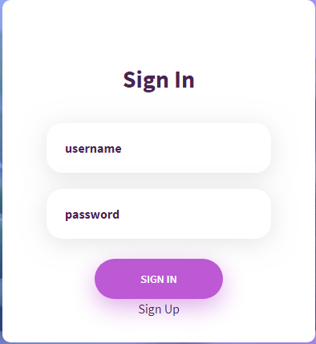
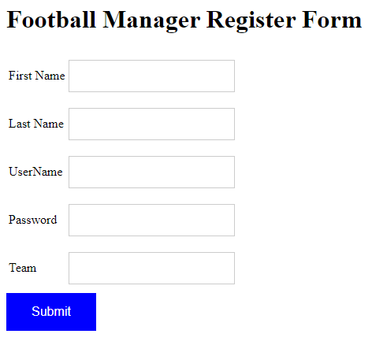
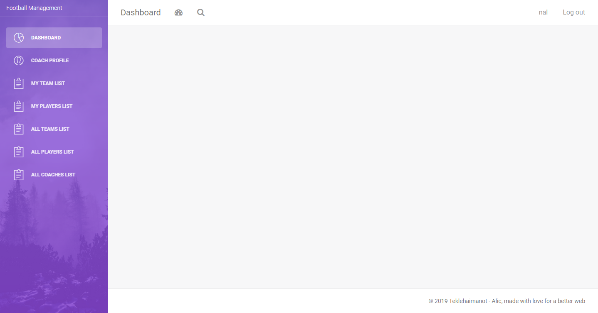
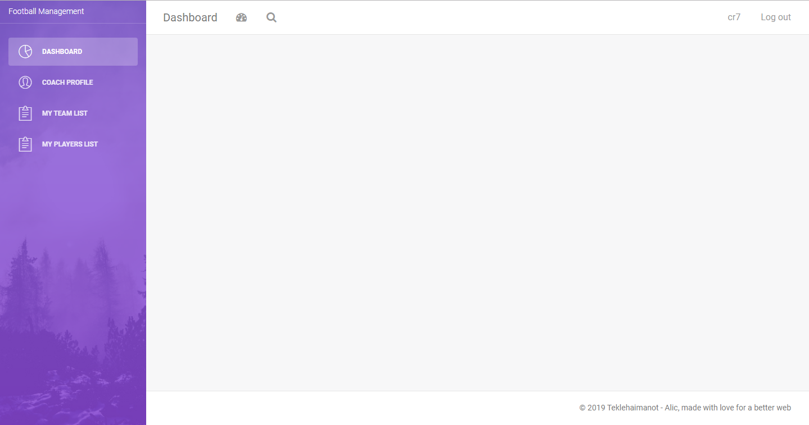

# Teaching-HEIGVD-AMT-2019-Project-One

Authors : Robel Teklehaimanot & Nair Alic

## Objectives

Here we explain how to use the web application. How to navigate through the pages. How to make updates on the data. Etc.

### Login - Authentication 

First time you navigate to the Web app you will be asked to connect to the application. There is 2 accounts which are already created. Or you can also create a new one using the "Sign Up link". (username : nal , password : pass) or (username : rtt , password : pass).

If you want to create a new account click on Sign Up. You will be redirected to a registration form which look like this.

Once you've registered, you will be redirected to the login page, where you can connect.

### Navigation

After you have logged in, the main page will appear. It will depend if you're an administrator or not. For example, the account "nal" is an administrator and "rtt" isn't. Administrator coaches have the possibility to manage teams, coaches and players. Simple coaches can only manage his teams and his profile.

Here is what looks the main page for an administrator : 

And here is for simple user :

### Data (add, delete, update)

To be completed.. 

